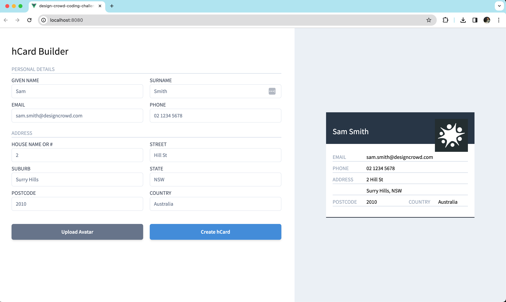
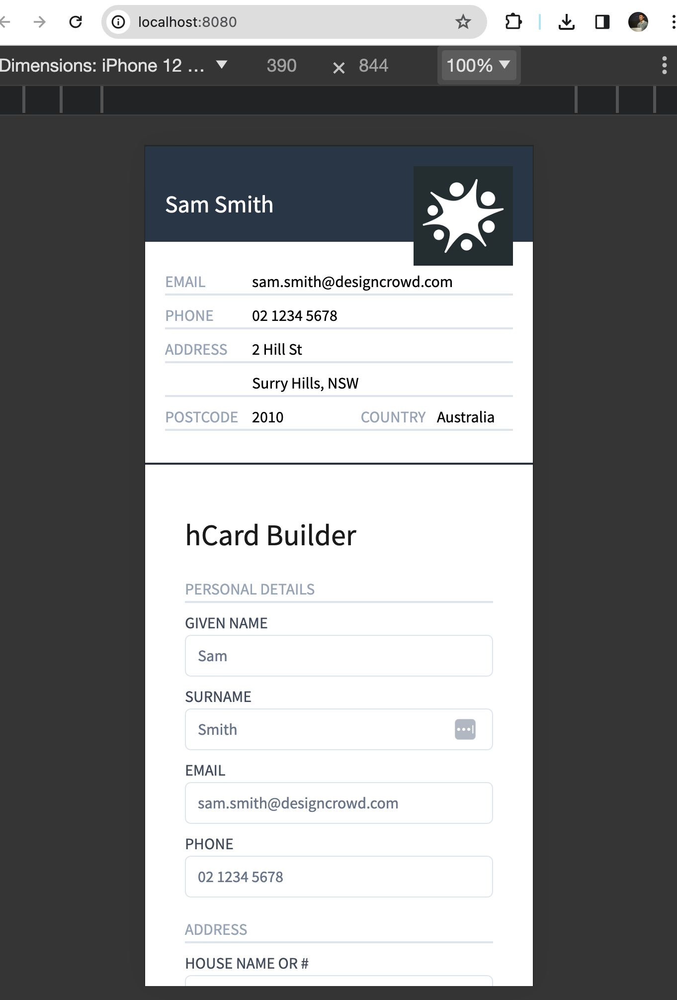
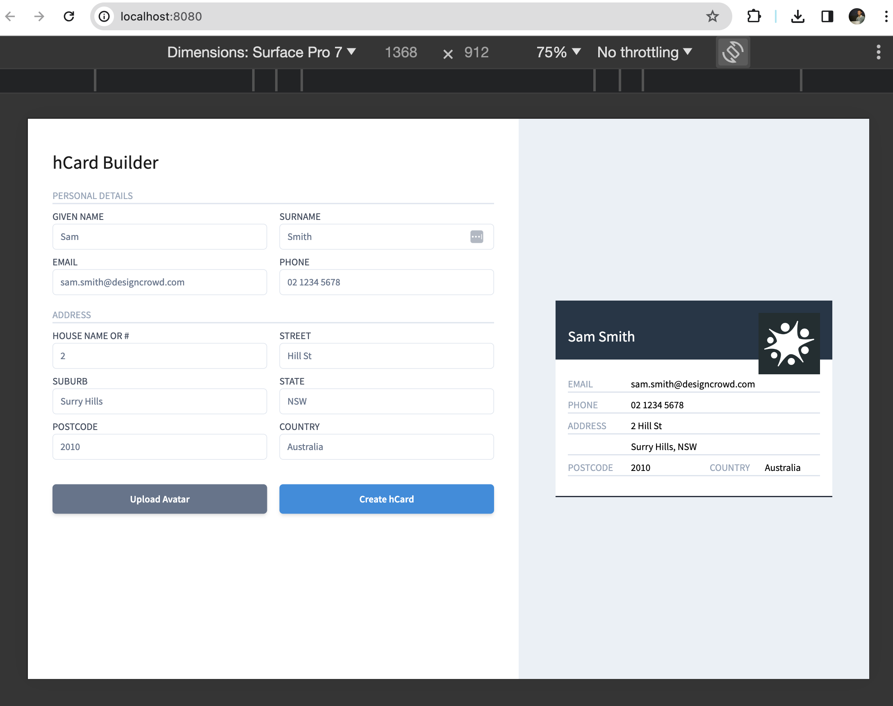

# Design Crowd Coding Challenge - Justin Hu

## Project setup
```
npm install
```

### Compiles and hot-reloads for development
```
npm run serve
```

### Compiles and minifies for production
```
npm run build
```

### Run your unit tests
```
npm run test:unit
```

### Lints and fixes files
```
npm run lint
```

## Notes
I use node v20.11.0 for this project.
Using node v18, v16 or lower may not work.
You may want to use mvn to install and switch node version.



